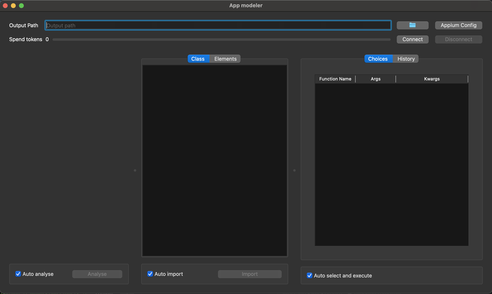

# app_modeler

`app_modeler` is a tool designed to generate application views as Python models and browse 
then automatically using AI (OpenAI). 



## Features

- simple User interface
- possible to use any application that appium supports
- Generate application views as Python models.
- Suggest next calls to the application views using openAI
- Possibility automatically browse the application views using the suggested calls.


## Requirements
- python 3.12
- appium server
- openAI API key


## Installation

To install the required dependencies, you can use the `setup.py` file. 

```
pip install -e .
```
