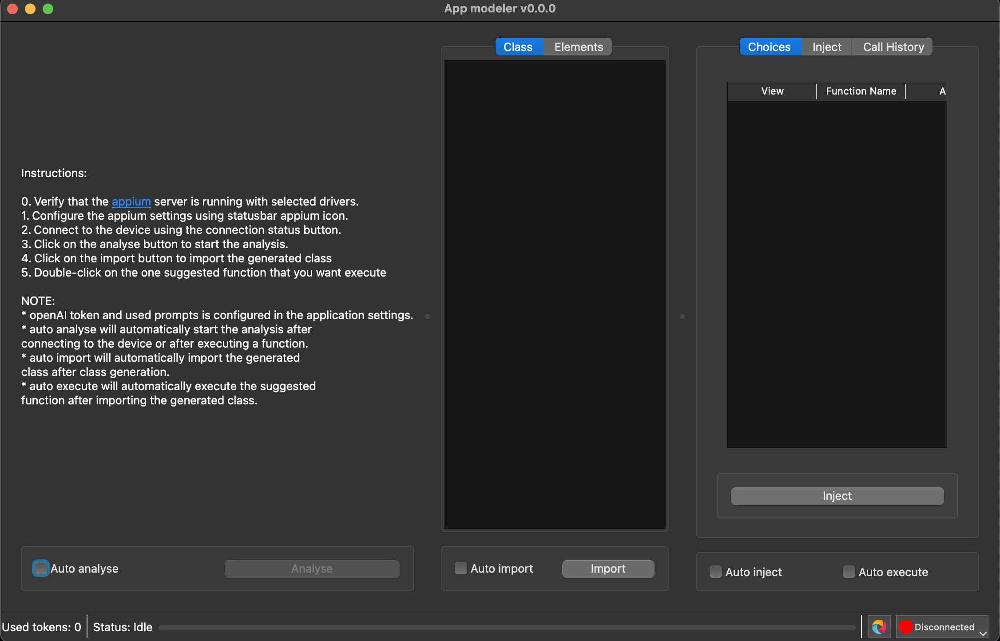

# App Modeler

`app_modeler` is a powerful, user-friendly tool designed to revolutionize the way you interact with 
Appium-supported targets, such as Android applications. 
Its cutting-edge features make it an essential companion for developers and testers aiming to 
automate and streamline their workflows.

🚧 Project Status: Under Development

This project is heavily under development, and its features are subject to change. While progress is ongoing, current functionality has been primarily tested and works best on Android apps. Support for other platforms or use cases is limited and may not yet be fully implemented.




## Key Features

* Effortless Connection: Seamlessly connect to any Appium-supported target, including Android applications, with minimal setup.
* Automatic View Analysis: Leverage the app’s intelligent engine to analyze application views and generate Python models, reducing manual effort and saving time.
* Scenario Generation: Automatically browse views to create comprehensive test scenarios, ensuring thorough coverage and reliability.
* Pytest Integration: Export generated scenarios directly as pytest test cases, enabling smooth integration into your existing testing pipelines.
* OpenAI-Powered Scenarios: Utilize OpenAI’s advanced capabilities to generate intelligent, context-aware test scenarios for your application.
* Customizable: Tailor the tool to suit your unique requirements, ensuring flexibility and adaptability for diverse projects.
* Cross-Platform: Enjoy a consistent, user-friendly experience on macOS, Windows, and Linux, thanks to a sleek and intuitive Qt-based interface.
* Fully Open Source: Take advantage of the transparency, extensibility, and collaborative potential of an open-source solution.

`app_modeler` combines cutting-edge automation, AI-driven intelligence, and a polished user interface to make 
application modeling and test generation faster, smarter, and more efficient than ever. 
Whether you’re a developer, a tester, or an automation enthusiast, 
`app_modeler` empowers you to deliver high-quality applications with ease.


## Disclaimer

This software include functionality for automatic execution, which could result in unintended or harmful actions depending on its configuration and use. By using this software, you agree to the following:
	•	Use at your own risk: You are solely responsible for understanding and reviewing the functionality of this software before using it.
	•	No warranty: This software is provided “as is” without any warranties, express or implied, including but not limited to warranties of merchantability or fitness for a particular purpose.
	•	Risk of harm: Automatic execution may result in data loss, system instability, or other harmful outcomes. Ensure you understand the impact of its operation before running it.
	•	Responsibility: The authors and contributors of this project are not liable for any damages, losses, or consequences arising from the use or misuse of this software.

Important: Use caution and thoroughly review the code, especially when running it in sensitive or production environments.


## Requirements
- python 3.12
- appium server
- openAI API key


## Installation

To install the required dependencies, you can use the `setup.py` file. 

```
pip install -e .
```
